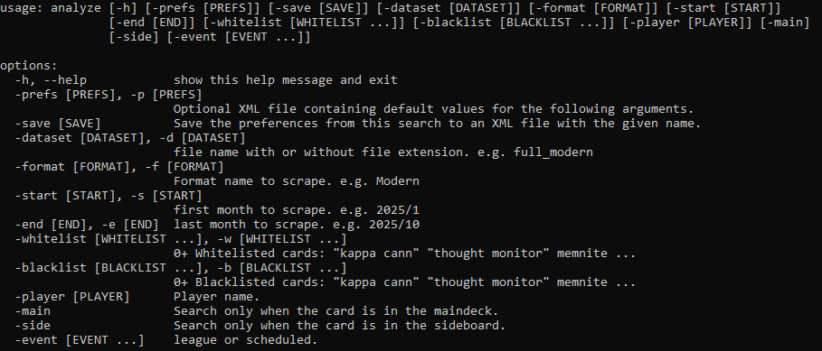
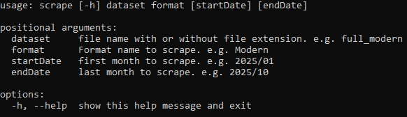

# Magic: The Gathering Online Card Choice Analyzer

This is a GUI / CLI applcation and web scraper that uses data published by MTGO.com to help tune competitive MTG decks and learn from historical deck trends.

Search for all information about decks based on criteria such as included cards, excluded cards, date, format, player, event, sideboard cards, and more. View this data on a deck-by-deck basis or review greater deck trends. This easy-to-use interface will help you keep up to date on the metagame and inform every deckbuilding choice.

You can also use these searches to generate charts that show how card choices have changed over time. Look at how a specific deck has evolved over time or use the preset groups to stay a step ahead of the metagame (ex. the prevalence of artifact strategies vs. artifact removal spells)

Use the included scraper or compiled datasets to see the newest results.

# Command Line Interface

The Scraper and Card Analyzer functionality is now available via the command line. To learn more, try out the commands below:

## Card Analyzer

Find detailed stats about decks right in the command line. Quickly adjust a wide variety of criteria to refine your searches.

python analyze.py -h

## Scraper

Scrape months worth of decks at a time using the scraper CLI. Easily maintain separate databases for different formats and timeframes.

python scrape.py -h

# GUI

## Demo - Deck Search

## Demo - Historical Chart

